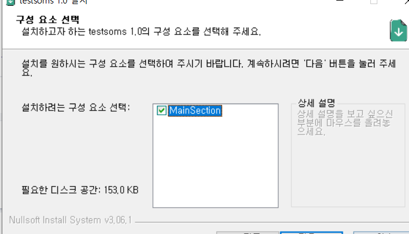
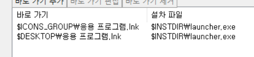

# 실행파일, 설치파일 제작

작성자 : 김인호

하나하나 다 넣기엔 귀찮으므로 7z 등의 압축파일로 올리고 즉시 압축을 푸는 것인가

## trouble shooting 

* 지정한 장치 경로 또는 파일에 액세스할 수 없습니다

  V3 백신 관련 이슈일 확률이 높음

  V3 설정 > PC 실시간 검사 > 클라우드 평판 기반 실행 차단 사용 **해제**

  

  ## NSIS 사용법
  
  main section 별로 설치 / 비설치 여부 결정하게 됨,
  
  
  
  이렇게 상세설명도 넣을 수 있다.
  
  
  
  이렇게 하니깐 시작메뉴, 바탕화면에 바로가기가 생겼다!
  
  execwait : exe파일만 가능, 실행시켜놓고 대기한다.